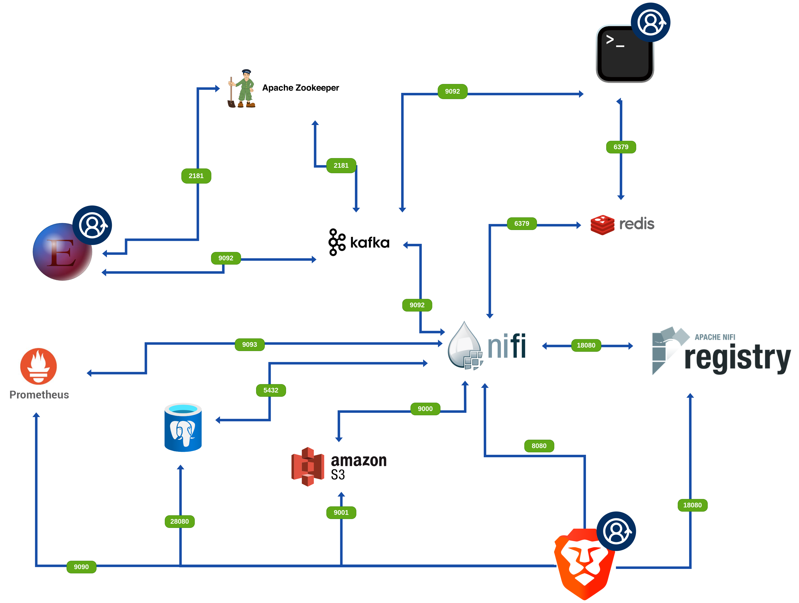

# Summary

- Environment
    - The Environment contains
    - The Environment Structure:
    - Short overview of all technologies:
- Code


# Environment

### The Environment contains:

- #### Apache NiFi
    
- #### Apache Nifi Registry
    
- #### Prometheus
    
- #### S3 \[minIO\]
    
- #### Redis
    
- #### Apache Kafka
    
- #### Apache Zookeeper
    
- #### PostgreSQL (server & client)
    

## The Environment Structure:



## Short overview of all technologies:

### NiFi

Apache NiFi is a powerful data routing and transformation system. It provides a graphical interface to design data flows and manage data processes in real-time. NiFi simplifies data ingestion, processing, and distribution across various systems and devices.

### NiFi Registry

NiFi Registry is a version control and management system for NiFi flows. It allows users to save, track changes, and manage versions of data flows created in NiFi. NiFi Registry facilitates collaboration, reuse, and deployment of data flow configurations across environments.

### Prometheus

Prometheus is an open-source monitoring and alerting toolkit. It collects metrics from monitored targets by scraping HTTP endpoints. Prometheus stores data in a time-series database and allows querying and visualization of metrics using a built-in expression language and various visualization tools.

### S3

Amazon Simple Storage Service (S3) is a scalable object storage service offered by Amazon Web Services (AWS). It provides secure, durable, and highly available storage for a wide variety of data types. S3 is commonly used for data backup, archival, and serving static web content.

**MinIO** - is an open-source, self-hosted object storage server compatible with Amazon S3. It allows users to store and manage large amounts of unstructured data in a distributed environment. minIO replicates the S3 API, enabling seamless integration with applications designed to work with S3 storage. As a lightweight and scalable solution, minIO is commonly used for various use cases, including data backup, archival, and serving static web content. It offers features such as data encryption, access control, and high availability, making it suitable for both small-scale deployments and enterprise-grade storage solutions

### Redis

Redis is an open-source, in-memory data structure store used as a database, cache, and message broker. It supports various data structures such as strings, hashes, lists, sets, and more. Redis is known for its high performance, versatility, and rich set of features.

### Kafka

Apache Kafka is a distributed streaming platform designed to handle real-time data feeds. It is used for building real-time data pipelines and streaming applications. Kafka provides fault tolerance, scalability, and high throughput for publishing, subscribing, and storing streams of records in a fault-tolerant manner.

### Zookeeper

Apache ZooKeeper is a centralized service for maintaining configuration information, naming, providing distributed synchronization, and providing group services. It is used by distributed systems to manage and coordinate processes in a distributed environment. ZooKeeper ensures high availability and reliability for distributed applications.

### PostgreSQL

PostgreSQL is an open-source relational database management system known for its robustness, scalability, and advanced features. Developed in the 1980s, it supports ACID compliance, various data types (like JSON and XML), and extensibility with custom data types and functions. Its Multi-Version Concurrency Control (MVCC) allows for high performance with concurrent transactions. PostgreSQL is widely used in web applications, data warehousing, and geospatial analysis, making it a popular choice for many industries.

### pgAdmin

pgAdmin is an open-source administration tool for PostgreSQL databases, offering a user-friendly graphical interface. It allows users to manage databases, execute SQL queries, and visualize data. Key features include a powerful query editor, backup and restore options, and cross-platform support. pgAdmin simplifies database management for both beginners and experienced users.

### Pointainer

Container with web user interface allowing us to manage and control other container in the docker. Web UI can be accessed on 9443 port. To be able to use this container go to **/CODE/Pointainer/** and run ```sudo docker-compose up -d``` in this folder

# Code:

## docker-compose.yml:

```yml
###--NiFi---###################################################################################################
version: '3'
services:
  nifi:
    image: apache/nifi:1.20.0
    container_name: nifi
    restart: unless-stopped
    network_mode: bridge
    volumes:
      - ./Docker_Mount/V_NiFi_VOLUME:/opt/nifi/nifi-current/VOLUME
    ports:
      # HTTP
      - 8080:8080/tcp
      # HTTPS
      #- 8443:8443/tcp
      # Remote Input Socket
      - 10000:10000/tcp
      # JVM Debugger
      - 8000:8000/tcp
      # Prometheus metrics
      - 9093:9093
      # Cluster Node Protocol
      #- 11443:11443/tcp
    environment:
      ########## Web ##########
      # nifi.web.http.host
      NIFI_WEB_HTTP_HOST: '0.0.0.0'
      # nifi.web.http.port
      #   HTTP Port
      NIFI_WEB_HTTP_PORT: 8080
###--NiFi-Registry---###################################################################################################
  registry:
    network_mode: bridge
    image: apache/nifi-registry:1.20.0
    container_name: nifi-registry
    restart: unless-stopped
    ports:
     - "18080:18080"
    environment:
     - LOG_LEVEL=INFO
     - NIFI_REGISTRY_DB_DIR=/opt/nifi-registry/database
     - NIFI_REGISTRY_FLOW_PROVIDER=file
     - NIFI_REGISTRY_FLOW_STORAGE_DIR=/opt/nifi-registry/flow_storage
###--Redis---###################################################################################################  
  redis:
    network_mode: bridge
    container_name: redis
    image: redis:6.2-alpine
    restart: always
    ports:
      - '6379:6379'
    command: redis-server --save 20 1 --loglevel warning --requirepass [set_up_the_password_here]
###--Kafka---###################################################################################################  
  zookeeper:
    image: wurstmeister/zookeeper
    container_name: zookeeper
    ports:
      - "2181:2181"
  kafka:
    image: wurstmeister/kafka
    container_name: kafka
    ports:
      - "9092:9092"
    environment:
      KAFKA_ADVERTISED_HOST_NAME: [IP_ADDRESS]
      KAFKA_ZOOKEEPER_CONNECT: zookeeper:2181
###--Prometheus---###################################################################################################  
  prometheus:
    image: prom/prometheus:v2.36.2
    container_name: prometheus
    command:
      - '--config.file=/etc/prometheus/prometheus.yml'
      - '--storage.tsdb.path=/prometheus'
      - '--web.console.libraries=/usr/share/prometheus/console_libraries'
      - '--web.console.templates=/usr/share/prometheus/consoles'
    ports:
      - 9090:9090
    restart: always
    volumes:
      - ./Docker_Mount/V_prometheus.yml:/etc/prometheus/prometheus.yml
###--minIO-S3---################################################################################################### 
  minio:
    image: minio/minio
    network_mode: bridge
    container_name: S3
    ports:
      - "9000:9000"
      - "9001:9001"
    volumes:
      - ./Docker_Mount/V_MINIO_storage:/data
    command: server --console-address ":9001" /data
    env_file: ./Docker_Mount/.env
    restart: always
###---PostgreSQL---###################################################################################################
  postgres:
    network_mode: bridge
    container_name: PostgreSQL
    image: 'postgres:latest'
    ports:
      - 5432:5432
    environment:
      POSTGRES_USER: [user]
      POSTGRES_PASSWORD: [password]
      POSTGRES_DB: nifi_db
    volumes:
    - ./Docker_Mount/V_PostgreSQL-data/:/var/lib/postgresql/data/
  pgadmin:
    image: dpage/pgadmin4
    container_name: pg_admin
    ports:
      - 28080:80
    network_mode: bridge
    environment:
        PGADMIN_DEFAULT_EMAIL: ${PGADMIN_DEFAULT_EMAIL:-[EMAIL_address]}
        PGADMIN_DEFAULT_PASSWORD: [password]

```

## .env:

```txt
MINIO_ROOT_USER=[user]
MINIO_ROOT_PASSWORD=[pass]
```

## prometheus.yml:

```yml
# my global config
global:
  scrape_interval: 15s # Set the scrape interval to every 15 seconds. Default is every 1 minute.
  evaluation_interval: 15s # Evaluate rules every 15 seconds. The default is every 1 minute.
  # scrape_timeout is set to the global default (10s).

  # Attach these labels to any time series or alerts when communicating with
  # external systems (federation, remote storage, Alertmanager).
  external_labels:
    monitor: "codelab-monitor"

# Load rules once and periodically evaluate them according to the global 'evaluation_interval'.
rule_files:
  # - "first.rules"
  # - "second.rules"

# A scrape configuration containing exactly one endpoint to scrape:
# Here it's Prometheus itself.
scrape_configs:
  # The job name is added as a label `job=<job_name>` to any timeseries scraped from this config.
  - job_name: prometheus

    # metrics_path defaults to '/metrics'
    # scheme defaults to 'http'.

    static_configs:
      - targets: ["localhost:9090"]

  - job_name: nifi
      # metrics_path defaults to '/metrics'
      # scheme defaults to 'http'.

    static_configs:
      - targets: ["[IP_ADDRESS]:9093"]
```
