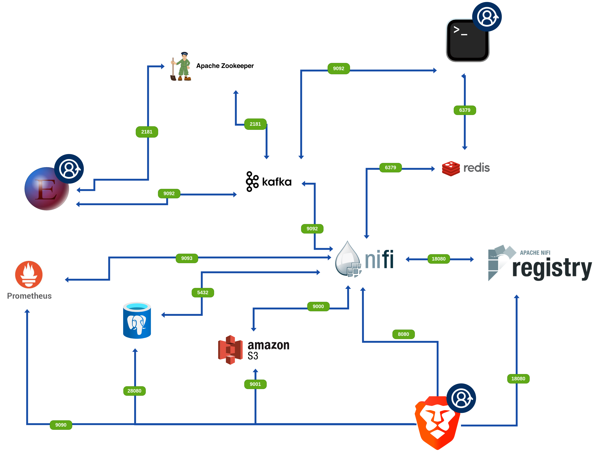

# First time here?

This repository was created to help you get familiar with NiFi environment. To start go to [**Docs**](./Docs/)   section and read [**environment_overview.md**](./Docs/environment_overview.md) and [**How_to_run_it.md**](./Docs/How_to_run_it.md) manuals and read what you can find here and how to use it. 

General summary of the whole repo you can find in this README file below:
- [Docs](#docs)
- [CODE](#code)
- [Tasks](#tasks)
- [Solutions](#solutions)

# Docs

Directory contains documentation about the docker-compose file and the environment itself. You can find there also instructions how to configure basic NiFi components

### Instructions

Here you will find instructions how to configure basic services in NiFi

### NiFiaaC.png

Environment overview:  

> softwares with blue icon are not provided within this repo

> [:point_up:]
> For detailes go [here](./Docs/)
# CODE

Here you can find code and files required to create an environment to work. If you do not know how to run docker-compose.yml file, go to  [**How_to_run_it.md**](./Docs/How_to_run_it.md) file in the Docs section.

### Common issues description:

##### If NiFi cannot start correctly at first deploy (first creation)

- Give full permission access to V_NiFi_VOLUME directory (chmod 777 -R V_NiFi_VOLUME) or hash lines 9 10 in the docker-compose.yml (we are working on solving this issue)

> [:point_up:]
> For detailes go [here](./CODE/)

# Tasks

Here you can find task to do during traings:

### Task 1

This task is focused on understanding basic NiFi components and the methods of developing dataflows.

#### What you will understand here:

- How to build easy dataflows in NiFi
- How to use math functions in NiFI Expression languages
- How to send data to **Kafka**
- How to send data to **Redis**
- How to write basic JOLT expression

### NiFi Expression Languages

Here you will focus on NiFi Expression Languages itself. We will show you how to create basic logic and strings operations

### Task 2

In this task you will focus on data integration between different database platforms. To Kafka and Redis we will add AWS S3 solution. Here you will also understand how to build more complex dataflow in Apache NiFi.

### Task 3

In this dataflow we move to more complex and complicated desing.

#### What you will understand here:

- How to load a driver to Service for PostgreSQL,
- How to call NiFI API to retrieve **Flow configuration history**
- How to log events occured in dataflow using **Log Attributes** and **Log Message**
- How to write more complex JOLT expression

### Task 4

In this dataflow you will use what you have learned to build complex Incidents Report. Additionally you will find how to send email from NiFi, convert dates and perform time-related operations

### Task 5

In this task a X posts sentiment analyzer will be created. We will fetch 10 posts from X, then check their sentiment using python script and then, we will load properly transporm data to kafka topic.

> [:point_up:]
> For detailes go [here](./Tasks/)

# Solutions

Here you can find solutions for tasks stored as flow definitions files (JSON). This format allows to import them using like process group.

> [:point_up:]
> For detailes go [here](./Solutions/)