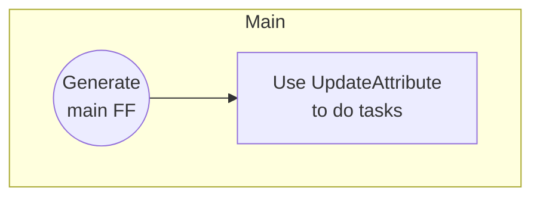

# NiFi Expression Languages

## Task description:

Create a dataflow which allows to perform below tasks:

1.  Compare if var1 equals var2 (as string)
2.  Return "succeeded" if var1 equals true (as string)
3.  extract value for "test" key from FF content
4.  check if number attribute is greated then 10
5.  convert var1 to uppercase

* * *

## Data flow model:



> FF - flowfile / event

## Data

### FF content

```JSON
{
    "test" : "true",
    "test2" : "true"
}
```

### FF attributes

| Attribute name | Value |
| --- | --- |
| number | 5   |
| var1 | true |
| var2 | false |

### Example


## Solution

```NiFi
###---Task1
${var1:equals(${var2})}

###---Task2
${var1:equals("true"):ifElse("sukces", "failed")}

###---Task3
${JSON:jsonPath("$.test")}

###---Task4
${anyAttribute("var1", "var2"):contains("true")}

###---Task5
${number:gt(10)}

###---Task6
${var1:toUpper()}

```
