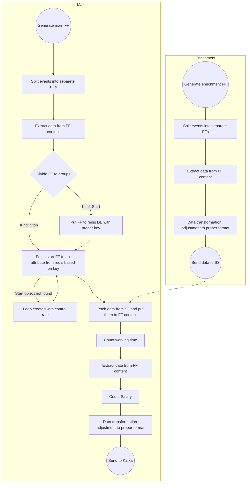

# Worktime counting system

## Task description:
Create a dataflow which counts employee working time based on events (stop working, start working). Each employee has two events in the main dataset (start and stop) and there is also one enrichment file with personal data for all employees. The common primary key for both datasets is CK (employee ID number). Datasets are stored in the bottom the this file


## Main Flow:

### Short description:

- Generating events upon the start and end of work
    - Events for the start of work are pushed to Redis.
    - Events for the end of work are sent to Kafka, enriched with information from Redis (start time of work) and data from S3 regarding the employee's personal information.
- Personal data of the employees are stored in S3.
- Matching should be based on the "CK" field.

### Detailed description

#### Main Process

1. **Generate Main FF**:
   - The workflow begins with the generation of the main FlowFile, which serves as the primary data entity for processing.
   - Processor name: `GenerateFlowFile`

2. **Split Events into Separate FFs**:
   - The main FlowFile is split into separate FlowFiles to handle individual events separatelly.
   - Processor name: `SpitJson`

3. **Extract Data from FF Content**:
   - Relevant data is extracted from the content of each FlowFile for further processing.
   - Processor name: `EvaluateJsonPath`

4. **Divide FF to Groups**:
   - The FlowFiles are categorized into two groups: **Start** and **Stop** events.
   - Processor name: `RouteOnAttribute`

5. **Handling "Start" Events**:
   - For FlowFiles identified as **Start** they are stored in Redis with a unique key for future reference.
   - Processor name: `PutDistributedMapCache`

6. **Handling "Stop" Events**:
   - For **Stop** FlowFiles, the process retrieves the corresponding **Start** FlowFile from Redis using the key.
   - If the **Start** FlowFile is not found, a loop is created to control the rate of retries until the **Start** FlowFile becomes available.
   - Processor name: `FetchDistributedMapCache` , `ControlRate`

7. **Fetch Data from S3**:
   - Once the **Start** FlowFile is successfully fetched, additional data is retrieved from S3 to enrich the FlowFile content.
   - Processor name: `FetchS3Object`

8. **Count Working Time**:
   - The working time is calculated based on the retrieved data.
   - Processor name: `UpdateAttribute`

9. **Extract Data from FF Content**:
   - Relevant information is extracted from the updated FlowFile content.
   - Processor name: `EvaluateJsonPath`

10. **Count Salary**:
   - The salary is calculated based on the extracted data and the working time.
   - Processor name: `UpdateAttribute`

11. **Data Transformation**:
   - The processed data undergoes transformation to ensure it meets the required format for further processing.
   - Processor name: `JoltTransformJSON`

12. **Send to Kafka**:
   - Finally, the enriched and transformed FlowFile is sent to Kafka for further handling or distribution.
   - Processor name: `PublishKafka_2_6`

#### Enrichment Process

1. **Generate Enrichment FF**:
   - A separate process generates enrichment FlowFiles that contain additional data necessary for enhancing the main FlowFiles.
   - Processor name: `GenerateFlowFile`

2. **Split Events into Separate FFs**:
   - Similar to the main process, these enrichment FlowFiles are split into separate entities for processing.
   - Processor name: `SpitJson`

3. **Extract Data from FF Content**:
   - Relevant data is extracted from the content of the enrichment FlowFiles.
   - Processor name: `EvaluateJsonPath`

4. **Send Data to S3**:
   - The transformed enrichment data is sent to S3 for storage or future use.
   - Processor name: `PutS3Object`

> **Connection**: There is a reverse relationship indicating that the enriched data stored in S3 can later be integrated back into the main FlowFiles during processing. Take a look on item `FetchS3Object` in **Main Flow**
    
## Data flow model:


> FF - flowfile / event
## Data

### Main Event:

```JSON
[{
 "operation" : "START",
 "time" : "1676201442000",
 "CK" : "AA11BB"
},
{
 "operation" : "START",
 "time" : "1676197842000",
 "CK" : "AA22BB"
},
{
 "operation" : "START",
 "time" : "1676212242000",
 "CK" : "AA33BB"
},
{
 "operation" : "START",
 "time" : "1676195742000",
 "CK" : "AA44BB"
},
{
 "operation" : "STOP",
 "time" : "1676201442000",
 "CK" : "AA11BB"
},
{
 "operation" : "STOP",
 "time" : "1676197842000",
 "CK" : "AA22BB"
},
{
 "operation" : "STOP",
 "time" : "1676212242000",
 "CK" : "AA33BB"
},
{
 "operation" : "STOP",
 "time" : "1676195742000",
 "CK" : "AA44BB"
}
]
```

### Enrichment data:

```JSON
[{
  "name" : "Michal",
  "surname" : "Kowalski",
  "position" : "engineer",
  "hourlyRate" : "20",
  "CK" : "AA11BB"
},
{
  "name" : "Kamil",
  "surname" : "Nowak",
  "position" : "trainee",
  "hourlyRate" : "10",
  "CK" : "AA22BB"
},
{
  "name" : "Monika",
  "surname" : "Hamik",
  "position" : "expert",
  "hourlyRate" : "50",
  "CK" : "AA33BB"
},
{
  "name" : "Kasia",
  "surname" : "Nowacka",```
  "position" : "expert",
  "hourlyRate" : "50",
  "CK" : "AA44BB"
}]
```

### END event:

```JSON
{
  "Salary" : "WorkingTime * hourlyRate",
  "position" : "position",
  "WorkingTime" : "STOP_time - START_time",
  "surname" : "surname",
  "hourlyRate" : "10",
  "name" : "name",
  "CK" : "AA22BB"
}
```
