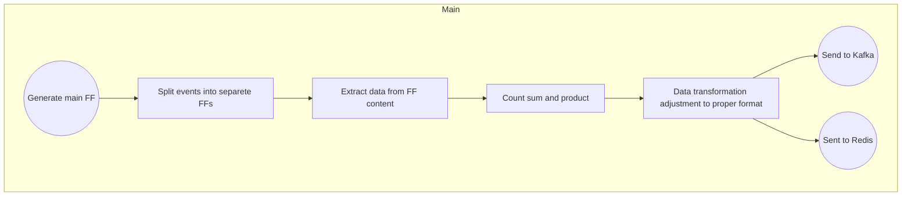

# Calculator

## Task description:
Create a dataflow allowing to count sum and product of 2 numbers provided in the dataset. Dataset is a JSON list shown at the bottom of this file

***

## Main Flow

### Short description:

- Generating events containing two numbers: A, B
    - Flow should calculate: sum, product
- The resulting flow should be sent to Kafka and Redis and should contain the numbers: A, B, sum(A, B), product(A, B)

### Detailed description

#### Main Process

1. **Generate Main FF (A)**:
   - The dataflow starts with the generation of the main FlowFile.

2. **Split Events into Separate FFs (B)**:
   - Then  main FlowFile is divided into separate FFs to handle individual events independently.

3. **Extract Data from FF Content (C)**:
   - Relevant data is extracted from the content of each FlowFile. This step is crucial for performing calculations and transformations in subsequent stages.

4. **Count Sum and Product (D)**:
   - The extracted data is used to calculate both the sum and the product of the relevant values.

5. **Data Transformation (E)**:
   - The results from the calculations are transformed and adjusted to ensure they meet the required format we want to sent to Kafka and Redis

6. **Send to Kafka (F)**:
   - The transformed data is sent to Kafka.

7. **Sent to Redis (G)**:
   -  The transformed data is sent to Redis

## Data flow model:


> FF - flowfile / event

## Data

```JSON
[
{
"A" : "10",
"B" : "20"
},
{
"A" : "15",
"B" : "15"
},
{
"A" : "5",
"B" : "10"
},
{
"A" : "8",
"B" : "15"
},
{
"A" : "25",
"B" : "25"
}
]
```

## END Event

```JSON
{
"A" : "<String>",
"B" : "<String>",
"SUM" : "A + B",
"PRODUCT" : "A * B"
}
```


