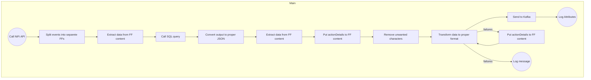

# Dashboard with NiFi configuration chages

## Task description:

### Create a flow that:

1.  Retrieves a list of changes performed by users in flow configuration history from the NiFi API.
2.  Extracts additional information about those users like names and emails from a PostgreSQL database.
3.  Publishes data to Kafka with format from **END event** section.
4.  Log success event

## Main Flow

#### Steps:

1.  **Retrieve the list of changes from NiFi API**:
    
    - Use the `InvokeHTTP` processor to call the NiFi API.
    - Use developer tools of the browser to check which API call should be called during history extractions
2.  **Process the response**:
    
    - Split list of objects to separated FF using `SplitJson` and then use the `EvaluateJsonPath` processor to extract information about the processors.
3.  **Fetch details from PostgreSQL**:
    
    - Use the `ExecuteSQL` processor to query the `users` table.
    - Use SQL query to retrieve data `SELECT * FROM users WHERE ck = '${userIdentity}';`.
4.  **Convert data to JSON**:
    
    - Use the `ConvertAvroToJson` processor to convert data to readable JSON format and `EvaluateJsonPath` to extract missing data from FF content after executing SQL query.
5.  **Put "actionDetails" to FF content**:
    
    - Use `AttributesToJSON` processor to change content in the FF and then remove unwanted characters using `ReplaceText`.
6.  **Create output FF in correct shape**:
    
    - Use `JoltTransformJSON` processor to adjust FF to required shape.
    - in case of any errors while processing resent **actionDetails** to FF content without removing unwanted characters and log that fact using `LogMessage` with proper comment
7.  **Logging**:
    
    - Use the `LogAttribute` processor put **email** and **operation** to the logs without Properties and Payload of successfully processed FF.

## Data flow model:


> FF - flowfile / event

## API call and example of the output

### Response from API

```JSON
{
  "history": {
    "total": 140,
    "lastRefreshed": "16:30:19 UTC",
    "actions": [
      {
        "id": 140,
        "timestamp": "10/16/2024 16:22:46 UTC",
        "sourceId": "96226d34-0192-1000-61c2-a6258b754575",
        "canRead": true,
        "action": {
          "id": 140,
          "userIdentity": "anonymous",
          "timestamp": "10/16/2024 16:22:46 UTC",
          "sourceId": "96226d34-0192-1000-61c2-a6258b754575",
          "sourceName": "InvokeHTTP",
          "sourceType": "Processor",
          "componentDetails": {
            "type": "InvokeHTTP"
          },
          "operation": "Configure",
          "actionDetails": {
            "name": "Remote URL",
            "value": "http://[IP_Address]:8080/nifi-api/processors"
          }
        }
      }
      ]
  }
}
```

## END event

```JSON
{
    "Personal" : {
        "CK" : "<String>",
        "Name" : "<String>",
        "Surname" : "<String>",
        "Email" : "<String>",
        "Position" : "<String>"
    },
    "Object" : {
        "componentDetailsType" : "<String>",
        "sourceId" : "<String>",
        "sourceName" : "<String>",
        "sourceType" : "<String>"	
    },
    "Timestamp" : "MM/DD/YYYY HH:mm:ss UTC",
    "OperationPerformed" : {
        "Operation" : "<String>",
        "actionDetails" : "<JSON_obj>"
    }
}
```

***

## Tables in PostgreSQL

### Database: `nifi_db`

1.  **Table: `users` using below commands**
    - **Description**: List of example users
    - **Columns**:
        - `CK` (employee id, primary key)
        - `name` (varchar)
        - `surname` (varchar)
        - `position` (varchar)
        - `email` (test, email address)

```SQL
CREATE TABLE users (
    user_id SERIAL PRIMARY KEY,
    ck VARCHAR(10) NOT NULL UNIQUE,
    name VARCHAR(255) NOT NULL,
    surname VARCHAR(255) NOT NULL,
    position VARCHAR(100),
    email VARCHAR(255) UNIQUE,
    created_at TIMESTAMP DEFAULT CURRENT_TIMESTAMP
);


INSERT INTO users (ck, name, surname, position, email) VALUES
('AA11BB', 'John', 'Doe', 'Data Analyst', 'john.doe@example.com'),
('SD22ED', 'Jane', 'Smith', 'Software Engineer', 'jane.smith@example.com'),
('XY34ZT', 'Alice', 'Johnson', 'Project Manager', 'alice.johnson@example.com'),
('AB12CD', 'Michael', 'Brown', 'UX Designer', 'michael.brown@example.com'),
('EF34GH', 'Emily', 'Davis', 'Data Scientist', 'emily.davis@example.com'),
('GH56IJ', 'Chris', 'Wilson', 'Systems Analyst', 'chris.wilson@example.com'),
('JK78LM', 'Jessica', 'Taylor', 'Network Engineer', 'jessica.taylor@example.com'),
('NO90PQ', 'David', 'Anderson', 'Database Administrator', 'david.anderson@example.com'),
('RS12TU', 'Sarah', 'Thomas', 'Web Developer', 'sarah.thomas@example.com'),
('VW34XY', 'Daniel', 'Moore', 'IT Support', 'daniel.moore@example.com'),
('YZ56AB', 'Laura', 'Martin', 'Business Analyst', 'laura.martin@example.com'),
('anonymous', 'James', 'Lee', 'Security Analyst', 'james.lee@example.com'),
('GH90IJ', 'Sophia', 'White', 'Product Manager', 'sophia.white@example.com'),
('KL12MN', 'William', 'Harris', 'Scrum Master', 'william.harris@example.com'),
('OP34QR', 'Olivia', 'Clark', 'Technical Writer', 'olivia.clark@example.com'),
('ST56UV', 'Matthew', 'Lewis', 'QA Engineer', 'matthew.lewis@example.com'),
('WX78YZ', 'Ava', 'Robinson', 'DevOps Engineer', 'ava.robinson@example.com'),
('AB90CD', 'Mason', 'Walker', 'Frontend Developer', 'mason.walker@example.com'),
('EF12GH', 'Isabella', 'Hall', 'Backend Developer', 'isabella.hall@example.com'),
('IJ34KL', 'Ethan', 'Allen', 'Data Engineer', 'ethan.allen@example.com'),
('MN56OP', 'Mia', 'Young', 'Software Tester', 'mia.young@example.com'),
('QR78ST', 'Liam', 'King', 'Cloud Engineer', 'liam.king@example.com'),
('UV90WX', 'Charlotte', 'Scott', 'IT Manager', 'charlotte.scott@example.com'),
('YZ12AB', 'Noah', 'Green', 'Business Intelligence Analyst', 'noah.green@example.com'),
('CD34EF', 'Amelia', 'Adams', 'Research Scientist', 'amelia.adams@example.com'),
('KL78MN', 'Sophia', 'Gonzalez', 'Marketing Analyst', 'sophia.gonzalez@example.com'),
('OP90QR', 'Lucas', 'Carter', 'Product Designer', 'lucas.carter@example.com'),
('ST12UV', 'Harper', 'Mitchell', 'E-commerce Specialist', 'harper.mitchell@example.com'),
('WX34YZ', 'Evelyn', 'Perez', 'IT Consultant', 'evelyn.perez@example.com'),
('AB56CD', 'Jackson', 'Roberts', 'Systems Administrator', 'jackson.roberts@example.com'),
('EF78GH', 'Avery', 'Turner', 'Mobile Developer', 'avery.turner@example.com'),
('IJ90KL', 'Ella', 'Phillips', 'Game Developer', 'ella.phillips@example.com'),
('MN12OP', 'Liam', 'Campbell', 'Hardware Engineer', 'liam.campbell@example.com'),
('QR34ST', 'Samantha', 'Parker', 'Cloud Architect', 'samantha.parker@example.com'),
('UV56WX', 'Henry', 'Evans', 'Software Architect', 'henry.evans@example.com'),
('YZ78AB', 'Madison', 'Edwards', 'Compliance Officer', 'madison.edwards@example.com'),
('CD90EF', 'Wyatt', 'Collins', 'SEO Specialist', 'wyatt.collins@example.com'),
('GH12IJ', 'Nora', 'Stewart', 'Data Privacy Officer', 'nora.stewart@example.com'),
('KL34MN', 'James', 'Sanchez', 'Content Strategist', 'james.sanchez@example.com'),
('OP56QR', 'Grace', 'Morris', 'Business Operations Manager', 'grace.morris@example.com'),
('ST78UV', 'David', 'Rogers', 'IT Auditor', 'david.rogers@example.com'),
('WX90YZ', 'Hannah', 'Reed', 'Digital Marketing Specialist', 'hannah.reed@example.com'),
('AB12ZD', 'Ethan', 'Cook', 'Information Security Manager', 'ethan.cook@example.com');

SELECT * FROM users;
```
