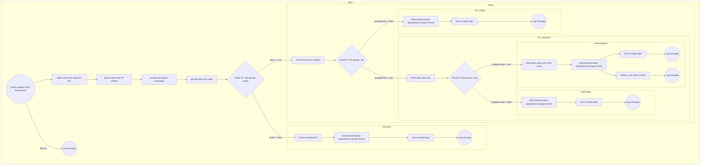

# Incidents report

## Task description:

Fetch data about incidents from Service-Now and divide them into groups (groups list is in the table below). Format incidents properly as specified in the section below (END Event) and for incidents which are active and assigned to a user, sent the email as a reminder (other just send to kafka topic from he below table).

## Detailed task content

### Fetching Incidents

- **Action:** Fetch incidents from ServiceNow.
- **Error Handling:** If there are failures during this step, generate a log message.
    - **Log Message content:** `Failed to retrieve incidents from ServiceNow. Please check the connection and try again.`

### Grouping FFs

- **Decision Point:** Divide FFs into groups based on their active status:
    - **Active = True**
        
        - **Next Steps:**
            
            - Count the time since creation.
            - Further categorize FFs based on Assigned Groups (AG).
            
            #### Active Group Processing
            
            - If AG is **not empty**:
                - Fetch additional data about the AG.
                - Further categorize based on user assignment:
                    - **Assigned User = True**
                        - Fetch data about the user from ServiceNow.
                        - Adjust data format and send to Kafka.
                        - Notify the user via email.
                        - Log messages for both sending to Kafka and user notification.
                    - **Assigned User = False**
                        - Adjust data format and send to Kafka.
                        - Log the action.
            - If AG is **empty**:
                - Adjust data format and send to Kafka.
                - Log the action.
    - **Active = False**
        
        - **Next Steps:**
            - Count working time.
            - Adjust data format to the proper format.
            - Send to Kafka topic.
            - Log the action.  
                <br/>

<table class="jop-noMdConv"><thead class="jop-noMdConv"><tr class="jop-noMdConv"><th class="jop-noMdConv">Active</th><th class="jop-noMdConv">AG assigned</th><th class="jop-noMdConv">User Assigned</th><th class="jop-noMdConv">Topic name</th><th class="jop-noMdConv">Log Message</th></tr></thead><tbody class="jop-noMdConv"><tr class="jop-noMdConv"><td class="jop-noMdConv">YES</td><td class="jop-noMdConv">YES</td><td class="jop-noMdConv">YES</td><td class="jop-noMdConv">incidents_active_assigned_person</td><td class="jop-noMdConv"><ul class="jop-noMdConv"><li class="jop-noMdConv">Event successfully sent to user email: Active incident assigned to a user.</li><li class="jop-noMdConv">Event successfully sent to Kafka: Active incident assigned to a user.</li></ul></td></tr><tr class="jop-noMdConv"><td class="jop-noMdConv">YES</td><td class="jop-noMdConv">YES</td><td class="jop-noMdConv">NO</td><td class="jop-noMdConv">incidents_active_asigned_AG</td><td class="jop-noMdConv">Event successfully sent to Kafka: Active incident not assigned to a user, but has an assignment group.</td></tr><tr class="jop-noMdConv"><td class="jop-noMdConv">YES</td><td class="jop-noMdConv">NO</td><td class="jop-noMdConv">N / A</td><td class="jop-noMdConv">incidents_active_notAssigned</td><td class="jop-noMdConv">Event successfully sent to Kafka: Active incident without user or assignment group.</td></tr><tr class="jop-noMdConv"><td class="jop-noMdConv">NO</td><td class="jop-noMdConv">N / A</td><td class="jop-noMdConv">N / A</td><td class="jop-noMdConv">incidents_notActive</td><td class="jop-noMdConv">Event successfully sent to Kafka: Inactive incident.</td></tr></tbody></table>

* * *

## Data flow model:



> FF - flowfile / event  
> AG - Assignment Group

## Data

### Connect to Service-now using below details and fetch incidents.

| Action | Value | Description |
| --- | --- | --- |
| Connection methon | GET | Fetch data without modification |
| URL | https://&lt;DEV-INSTANCE&gt;.service-now.com/api/now/table/incident | Endpoint to connect to |
| &lt;DEV-INSTANCE&gt; | \-  | Service-now instance created for each training session. Will be provided during training |
| Credentials: username & password | \-, - | Credentials separated for each Service-now user. Will be provided during training |

### END event:

```JSON
{
    "type" : "<topic_name>",
    "main details": {
        "number": "number",
        "active": "active",
        "priority": "priority",
        "severity": "severity",
        "close_code": "close_code"
    },
    "identities" : {
        "caller": {
            "name" : "caller_name",
            "surname": "caller_surname",
            "email": "caller_email",
            "id" : "caller_id.value"
        },
        "assignment_group": {
            "name" : "AG_name",
            "email": "AG_email",
            "id" : "assignment_group.value"
        },
        "assigned_to": {
            "name" : "assignee_name",
            "surname": "assignee_surname",
            "email": "assignee_email",
            "id" : "assigned_to.value"
        }
    },
    "details" : {
        "short_description": "short_description",
        "description" : "description"
    },
    "time details": {
        "opened_at": "opened_at",
        "resolved_at": "resolved_at",
        "closed_at": "closed_at",
        "solving_time" : {
            "days" : "solving_time_day",
            "hours" : "solving_time_hours",
            "minutes" : "solving_time_minutes",
            "seconds" : "solving_time_sec"
        }
    }
}
```

### Output examples:

```JSON
{
  "time details" : {
    "solving_time" : {
      "minutes" : "26",
      "hours" : "11",
      "seconds" : "47",
      "days" : "1"
    },
    "closed_at" : "2016-12-14 02:46:44",
    "opened_at" : "2016-12-12 15:19:57",
    "resolved_at" : "2016-12-13 21:43:14"
  },
  "identities" : {
    "caller" : {
      "surname" : "Employee",
      "name" : "Joe",
      "id" : "681ccaf9c0a8016400b98a06818d57c7",
      "email" : "employee@example.com"
    },
    "assigned_to" : {
      "surname" : "",
      "email" : "",
      "id" : "",
      "name" : ""
    },
    "assignment_group" : {
      "email" : "",
      "name" : "",
      "id" : ""
    }
  },
  "main details" : {
    "active" : "false",
    "close_code" : "Solved (Permanently)",
    "severity" : "3",
    "priority" : "3",
    "number" : "INC0000060"
  },
  "type" : "incidents_notActive",
  "details" : {
    "description" : "I am unable to connect to the email server. It appears to be down.",
    "short_description" : "Unable to connect to email"
  }
}

```

```JSON
{
  "type" : "incidents_active_assigned_person",
  "details" : {
    "short_description" : "I can't get my weather report",
    "description" : "WeatherBug icon has disappeared from my desktop. Unable to get my weather report."
  },
  "main details" : {
    "active" : "true",
    "number" : "INC0000029",
    "priority" : "5",
    "severity" : "3",
    "close_code" : ""
  },
  "identities" : {
    "caller" : {
      "name" : "Charlie",
      "email" : "charlie.whitherspoon@example.com",
      "id" : "46b87022a9fe198101a78787e40d7547",
      "surname" : "Whitherspoon"
    },
    "assignment_group" : {
      "id" : "",
      "email" : "service.desk@yourcompany.com",
      "name" : "Service Desk"
    },
    "assigned_to" : {
      "name" : "Don",
      "id" : "9ee1b13dc6112271007f9d0efdb69cd0",
      "surname" : "Goodliffe",
      "email" : "don.goodliffe@example.com"
    }
  },
  "time details" : {
    "opened_at" : "2024-02-13 00:00:44",
    "closed_at" : "",
    "resolved_at" : "",
    "solving_time" : {
      "minutes" : "7",
      "days" : "252",
      "seconds" : "19",
      "hours" : "23"
    }
  }
}
```

