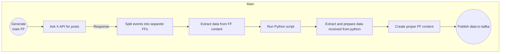

# Twitter / X posts sentiment analyzer

Create a dataflow which loads 10 posts (twits) from X platforms and check their sentiment. To do so, you can use Textblob python module. Results with counted sentiment (polarity and subjectivity) send to katka topic (twitter_posts). 

## Main Flow:

1. **Generate main FF**: The flow starts by generating the main FF data format.
2. **Ask X API for posts**: The system queries an external X API to retrieve posts.
3. **Split events into separate FFs**: The retrieved posts are split into separate FF events.
4. **Extract data from FF content**: Relevant data is extracted from the content of each FF.
5. **Run Python script**: A Python script is executed to process the extracted data.
6. **Extract and prepare data from Python**: Data received from the Python script is extracted and prepared for further use.
7. **Create proper FF content**: The prepared data is used to create the correct FF content.
8. **Publish data to Kafka**: The final FF content is published to Kafka for further consumption.

## Data flow model:


> FF - flowfile / event

## Python script:
```Python

from textblob import *

def checkSentiment(tweet_content):
    analysisPol = TextBlob(tweet_content).polarity
    analysisSub = TextBlob(tweet_content).subjectivity
    return analysisPol, analysisSub
import sys

twit_text = sys.argv[1]


analysisPol, analysisSub = checkSentiment(twit_text)

output = [analysisPol, analysisSub]

print(output)

```

## How to get X account
Here we assume that you have already created and configured X account with API access. 

### Usefull links for X documentation:

- https://developer.x.com/en/docs/x-api/tweets/search/introduction
- https://developer.x.com/en/docs/tutorials/step-by-step-guide-to-making-your-first-request-to-the-twitter-api-v2